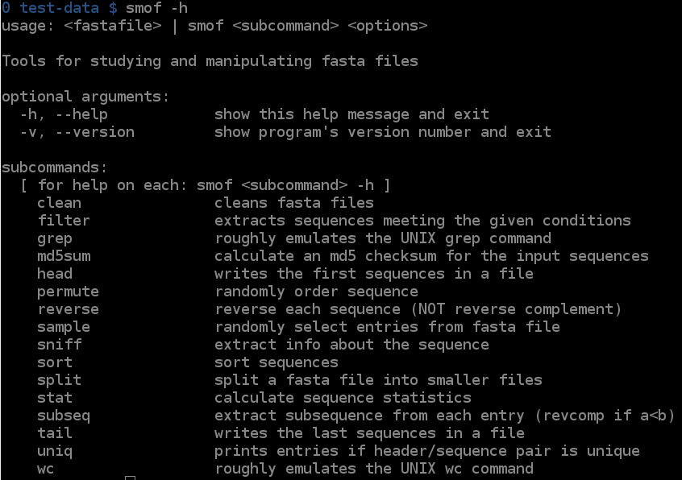
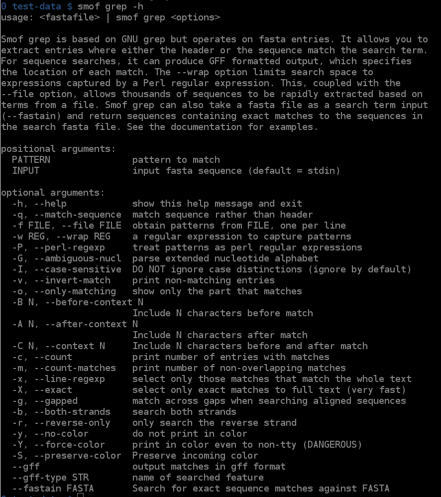
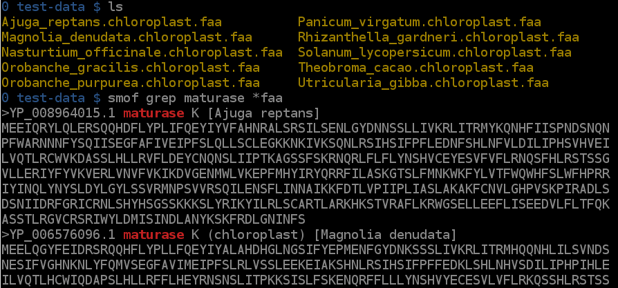
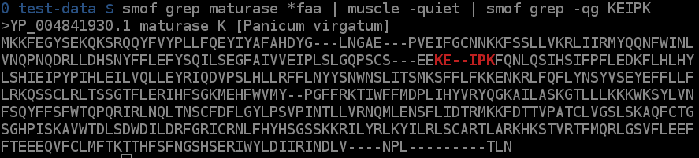
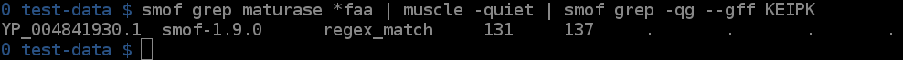
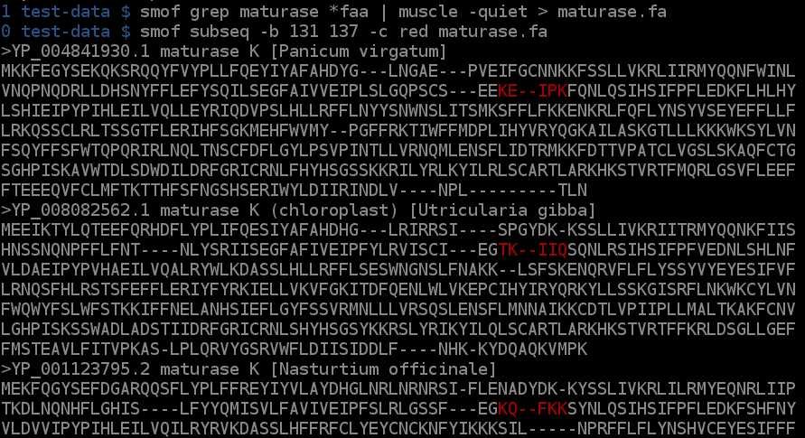
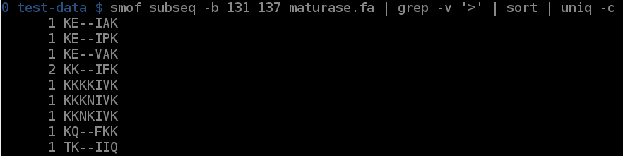

[](http://github.com/badges/stability-badges)
[](https://travis-ci.org/incertae-sedis/smof) 
[](https://zenodo.org/badge/latestdoi/19203682)

smof
====

UNIX-style FASTA tools

Install
=======

`smof` is a Python3 package that can be installed with `pip`. You must use
a Python 3 version of `pip`. This may be named `pip3`, `pip3.7`, or something.
You can check the version of your `pip` command with the `--version` flag. 

```
pip3 install smof
```

Functions
=========

`smof` is divided into the following subcommands:

| subcommand | description                                           |
| ---------- | ----------------------------------------------------- |
| `cut`      | emulates UNIX cut command, where fields are entries   |
| `clean`    | cleans fasta files                                    |
| `filter`   | extracts sequences meeting the given conditions       |
| `grep`     | roughly emulates the UNIX grep command                |
| `md5sum`   | calculate an md5 checksum for the input sequences     |
| `head`     | writes the first sequences in a file                  |
| `permute`  | randomly order sequence                               |
| `reverse`  | reverse each sequence (or reverse complement)         |
| `sample`   | randomly select entries from fasta file               |
| `sniff`    | extract info about the sequence                       |
| `sort`     | sort sequences                                        |
| `split`    | split a fasta file into smaller files                 |
| `stat`     | calculate sequence statistics                         |
| `subseq`   | extract subsequence from each entry (revcomp if a\<b) |
| `tail`     | writes the last sequences in a file                   |
| `uniq`     | count, omit, or merge repeated entries                |
| `wc`       | roughly emulates the UNIX wc command                  |

This documentation can be accessed interactively:

```
smof -h
```

Also documentation for individual subcommands can be accessed:

```
smof grep -h
```

Screenshots
===========

















Related Work
============

## `FAST`

The program most similar to `smof` is [FAST](https://github.com/tlawrence3/FAST):

> Lawrence, Travis J., et al. "FAST: FAST Analysis of Sequences Toolbox." Frontiers in Genetics 6 (2015): 172.

Their work was published in May of 2015. The paper is well written and cogently
argued for the need of bioinformatics tools that follow UNIX philosophy. FAST
is elegant, well documented, and has several nice features missing in `smof`.
I'll compare the two programs below.

### Installation

Installing `FAST` was fairly easy, though I had to resort to installing from
source (this just involved cloning the repo and pasting in the installation
code they provided). `FAST` has much heavier dependencies than `smof`, which
I imagine could lead to installation problems.

Installing `smof` is easy IF python3 is installed and is linked to the
`python3` executable. If not, you would have to change the hashbang in
`smof.py`.

Conclusion: `smof` wins by a nostril hair

### Documentation

Accessing documentation for a command interactively is easy in both programs:

```
smof grep -h
perldoc fasgrep
```

Through `perldoc`, `FAST` provides information comparable to `man grep` (or
`info grep`). `smof` provides a list of argument descriptions and a short
summary, comparable to `grep --help`.

`FAST` also provides nice cook books on the github site. Also, `FAST` has
a published paper.

Conclusion: `FAST` takes the cake

### Speed

`smof` is much faster for all comparable functions. This is due to `FAST`'s
basis on BioPerl, a dreadfully slow library.

Here are a few quick comparisons using Arabidopsis nuclear (`at.fna`),
protein (`at.faa`), and transcript (`at.ffn`) FASTA files (Araport11 annotation, if you care).


For searching patterns in FASTA headers, `smof` is 2X faster
```
$ time smof grep AT4G02020 at.faa > /dev/null
real    0m0.542s
user    0m0.539s
sys     0m0.003s
$ time fasgrep AT4G02020 at.faa > /dev/null
real    0m1.259s
user    0m1.248s
sys     0m0.010s
```

For sorting, `smof` is 5X faster
```
$ time smof sort at.faa > /dev/null
real    0m0.598s
user    0m0.567s
sys     0m0.030s
$ time fassort at.faa > /dev/null
real    0m3.272s
user    0m3.225s
sys     0m0.047s
```

`smof` is slightly slower for reverse complements. This benchmark is a little
complicated, though, since the packages are doing slightly difference things.
If validation is turned off in `smof`, it is much fasta than `FAST`, but will
happily attempt to reverse transcribe amino acid sequence.
```
$ time smof reverse -c at.ffa > sz
real    0m9.125s
user    0m8.152s
sys     0m0.157s
$ time smof reverse -c --no-validate at.ffa > sz
real    0m2.741s
user    0m2.305s
sys     0m0.130s
$ time fasrc at.ffa > fz
real    0m7.982s
user    0m7.589s
sys     0m0.153s
```

Conclusion: `smof` is faster (though both are far slower than a good C implementation)

### Input / Output

Both packages, of course, handle FASTA input and output. `FAST` offers the
`fasconvert` function to convert between formats (e.g. ClustalW alignments to
FASTA). Also, I believe, `FAST` can handle FASTQ data in addtion to FASTA.

The only non-FASTA format that `smof` understands is GFF, which it can use to
get sub-sequences from a FASTA file or as an output of grep.

Conclusion: `FAST` has better support of IO formats

### Community

`FAST` has one, `smof` doesn't.

### Features

This is far from a complete comparison. I'll try to "complete" it (whatever
that means) at some point.

Advantages of `FAST`

 1. Has is an interface to the NCBI taxonomy, which allows selection of
    sequences based on clade.

 2. Finer subdivision of headers. `FAST` breaks headers into a list of fields
    and a description. For example:

 3. ...

```
$ fasgrep --field 2 ARV1 at.faa | head -2
>AT1G01020.1 | ARV1 family protein | Chr1:6915-8666 REVERSE LENGTH=245 | 201606
MAASEHRCVGCGFRVKSLFIQYSPGNIRLMKCGNCKEVADEYIECERMIIFIDLILHRPK
```

    I don't have an easy way to do this in `smof` (though I could implement it).

 3. maintains a log file of operations

 4. `fasconvert`

Advantages of `smof`

 1. Diagnostic and statistics functions (`stat` and `sniff`)

 2. match highlighting in `subseq` and `grep`

 3. `smof` allows fast subsetting

``` sh
# Make a random list of ids
$ sed -nr '/>/s/>([^ ]+).*/\1/p' at.faa | sort -R | head -100 > ids.txt

# runs in O(mn) time
$ time for i in $(cat ids.txt); do fasgrep $i at.faa; done > /dev/null
real    2m6.452s
user    2m5.080s
sys     0m1.323s

# Runs in rougly O(m + n), for each entry, a pattern is extracted and matched
# against the list of ids in `ids.txt`. # This all thousands of entries to be
# extracted in about as much time as it takes to read the file.
$ smof grep -w '^([^ ]*)' -f ids.txt at.faa > /dev/null
real    0m0.571s
user    0m0.565s
sys     0m0.007
```

 4. ...

### Conclusion

 * `smof` is faster
 * `FAST` is better documented
 * `FAST` allows more inputs and output types.
 * Both have unique and useful features

The good news is that we don't have to choose between them; they can be used in
the same pipeline.
